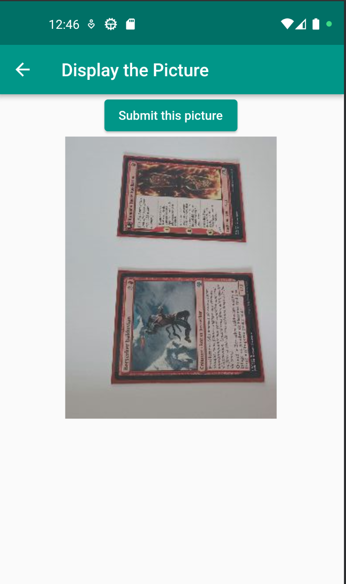

# grp06_ScanningZeMagic_Abele-Mouchet-Mouchet

## Description
Ce projet de traitement d'images à pour objectif d'analyser les données contenues sur une carte Magic afin de déterminer si celle-ci passe le [Vanilla Test](https://mtg.fandom.com/wiki/Vanilla). Pour ce faire, nous avons réalisé une application Flutter (smartphone multiplateforme) qui prend une ou plusieurs cartes en photos. Ces images sont envoyées à une API Flask qui se charge du traitement d'images grâce à OpenCV et renvoie un JSON contenant les informations tirées des images.

## Tester l'application
### Installer tesseract
Tesseract à été utilisé pour faire de la détection de texte, il doit être installé manuellement.
Pour cela il suffit de suivre ce [Tuto](https://stackoverflow.com/questions/50951955/pytesseract-tesseractnotfound-error-tesseract-is-not-installed-or-its-not-i) et s'assurer qu'il a bien été télécharger à ce chemin d'accès "'C:/Program Files/Tesseract-OCR/tesseract.exe'", sinon l'application ne pourra pas fonctionner.
### Lancer l'app Flask
Le fichier `requirements.txt` contient les libraires nécessaires afin de lancer l'application. 
Pour les télécharger : `pip install -r requirements.txt`

L'app peut ensuite être lancée dans un Powershell grâce à `flask --app main.py run`    
Si vous êtes sur Linux: `export FLASK_APP='main.py'` puis `flask run --debug`
(Nous ne recommendons pas l'utilisation d'un venv, la mise en place de tesseract ainsi que l'affichage des images pour le debug n'est pas possible)

### Lancer l'app Flutter
Nous avons testé notre application grâce à l'émulateur Android Studio.
Il faut dans un premier temps [installer Flutter](https://docs.flutter.dev/get-started/install/windows)
Si vous travaillez sur VSCode, il faut aussi ajouter l'extension Flutter. (F5 pour lancer l'app)

### Tester le traitement d'images
Afin de tester les fonctionnalités en local, il suffit de lancer `test_local.py`. Ce fichier effectuera les différents traitements sur les images contenues dans le dossier images.

## Remarques
Certaines fonctionnalités sont "hardcodées", l'envoi de l'images est simulé et envoie une image stockée dans les ressources. 
L'application mobile communique avec le LocalHost de l'ordinateur. 
L'émulateur et le serveur doivent être sur la même machine (si le serveur n'est pas déployé évidemment)

## Résultats
Une vidéo de démonstration est disponible dans le dossier `screenshots`

